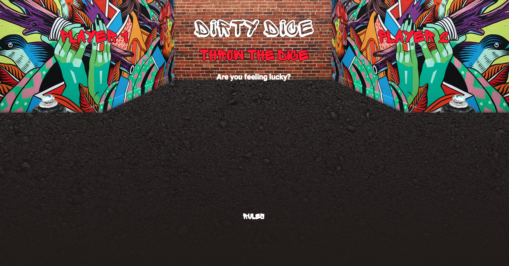
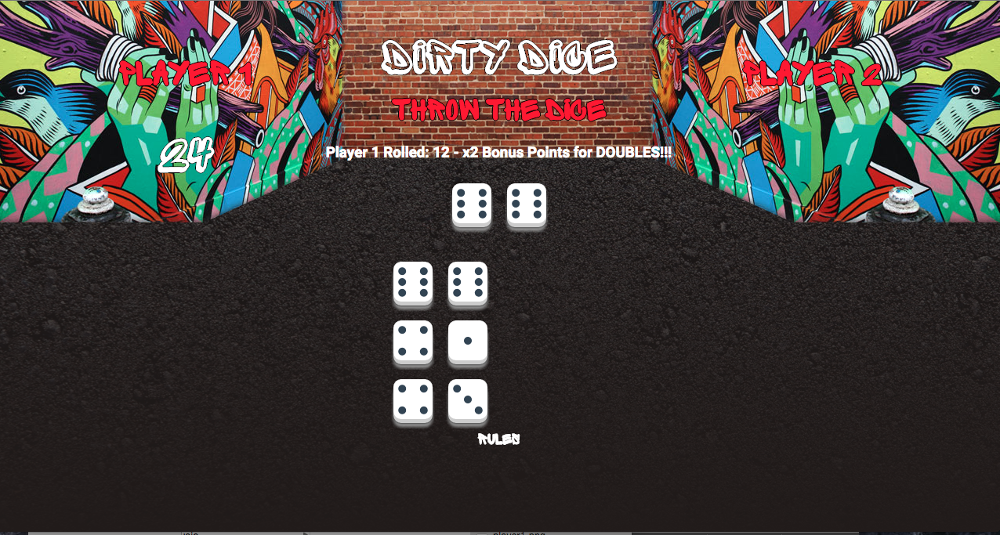
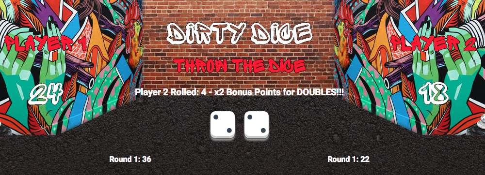
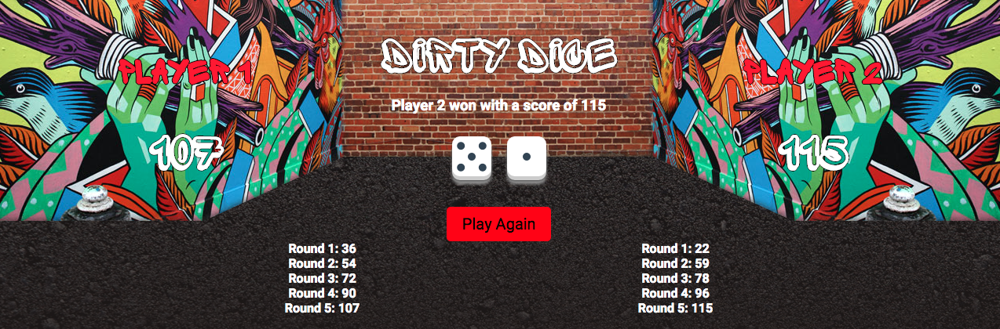

## Dirty Dice
### GA WDI 16 London - Project 1

#### Let's play a game of dice!!!
##### The Concept: A simple two player game with a twist of street craps and bowling.



##### [Play The Game!!](https://dirtydice.herokuapp.com/)

#### The Rules:
* Dirty dice is a two player game
* A full game has 5 rounds.
* Each round consists of 3 rolls of 2 dice.
* Player one start the game.
* After player one has their dice 3 times, it becomes player two's turn.
* Once player two has thrown the dice for the third time, it signals the end of the round and switches back to player one to start the next round.
* The winner is the player with the highest score after 5 rounds.
* Bonus points are rewarded to a player who roll a double. If a player achieves this, then the points are doubled.

 


#### My Vision:
I’ve always liked the hustle and realness of street craps and wanted to portray this in my game. I also wanted to simplify the game for the user by add the bowling format and keep it fun and exciting with the addition of bonus points for rolling doubles. The styling was to keep with the street hustle factor with a touch of the colourful culture of Shoreditch.

#### Approach / How It Works:
The script has been done in a more functional way. Once the first player clicks on to the "Throw The Dice" button, the *setUp* function in my script starts to work its way through. The *rollDice* function has been set up to generate 2 random values between 1 & 6 and add them toward to give us a total. This this occurs, the script checks how many throws have been taken. The function called *newRound* will append the round scores if the total number of rolls comes to 6 (index 5). If this is so the next round commences, if not then the numbers of rolls it increment up by 1. This will continue until player two threw the last dice in the fifth round. The *gameOver* function will alert who the winner is and their score and if you would like to play again. This will be where the *reset* function kick starts and the whole process begins once again.



#### The Build:
* HTML 5, CSS and jQuery were used to create this game.
* Dice animation was created using the animate.css stylesheet.
* Both Sprite Graffiti and Sprite Graffiti Shadow font have been used to style the game.

#### Wins:
I was very happy with the animation of the dice and the style of the game. I feel it gives the game a pleasant visual view into the hustle of dice. The actual code has been organised to be easy to follow through and make changes if necessary.

#### Challenges:
Pseudo-code is something I need to keep practicing as I will make my process and progress in the other projects far easier. Time was a factor as I didn’t plan enough to for myself to add sound effects to the game.
  
